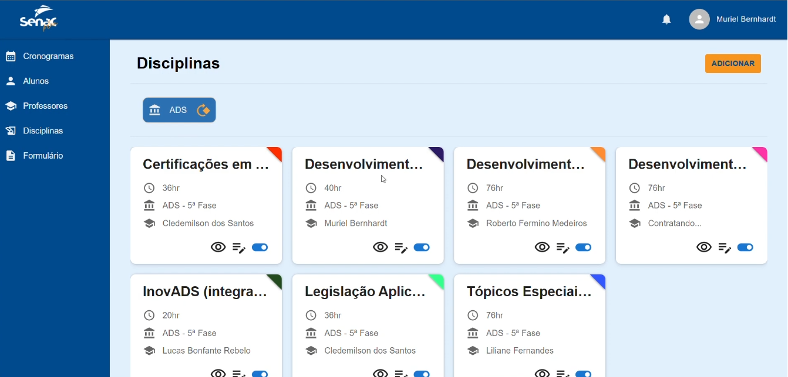
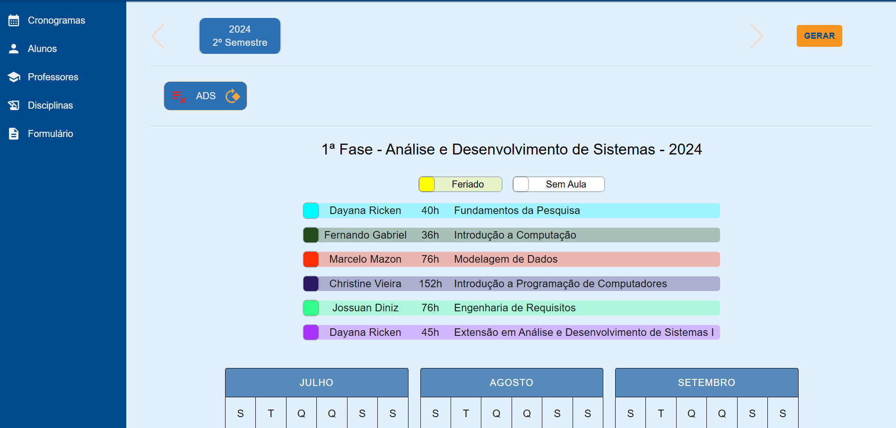
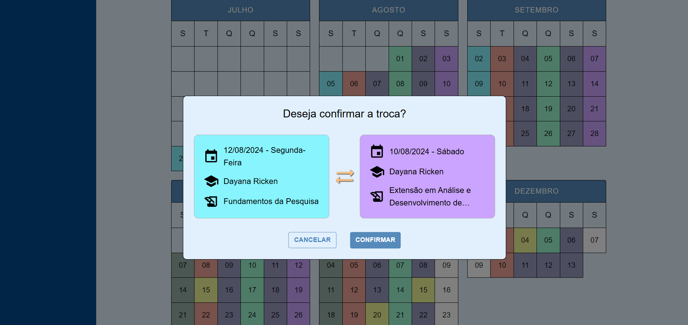

# cronograma-app

**Front-End do TCS de Analise e Desenvolvimento de Sistemas** 
**SenacPlan -  Gerador de cronogramas de aulas**

**Equipe:**
Barbara [linkedin](https://www.linkedin.com/in/barbara-s-b052b1140/), 
Gustavo [linkedin](https://www.linkedin.com/in/gustavo-albonico-goncalves/), 
Julia  [linkedin](https://www.linkedin.com/in/juliatibes/), 
Maria Eduarda [linkedin](https://www.linkedin.com/in/maria-eduarda-rebelo-961306193/).

**Resumo:**
  O Senacplan é um sistema desenvolvido para organizar cronogramas de aulas na Faculdade Senac Criciúma. O objetivo principal é oferecer uma plataforma prática e intuitiva que facilite o planejamento acadêmico. Para isso, o projeto focou em aprimorar a versão anterior, que apresentava limitações quanto à usabilidade e funcionalidade. Com uma nova interface, identidade visual alinhada à instituição, e níveis de acesso hierárquicos, o sistema permite que coordenadores gerenciem horários com eficiência, professores ajustem suas disponibilidades e alunos acessem cronogramas de forma prática. Os métodos envolveram pesquisa, análise de requisitos, modelagem do sistema e desenvolvimento de testes para garantir a eficácia das funções implementadas. Como resultado, a aplicação promoveu maior agilidade e organização no planejamento acadêmico. Concluiu-se que, embora o sistema atual apresente melhorias significativas, novas funcionalidades ainda podem ser adicionadas para atender plenamente às necessidades de todos os cursos
  
**Tecnologias Utilizadas/Ferramentas:**
- Frontend: Reactjs + Typescript + Material-UI
- Backend: Java + Spring Boot 
- Banco de dados: Postgresql
- Figma
- Postman
- GitHub

**Videos e Imagens:**
- [Post com video de demonstração do sistema](https://www.linkedin.com/feed/update/urn:li:activity:7282042694523064320/).
- [Post explicando as tecnologias](https://www.linkedin.com/feed/update/urn:li:activity:7284558012415942656/).
- [Login](https://www.linkedin.com/feed/update/urn:li:activity:7282042694523064320/)
    <a href="https://www.linkedin.com/feed/update/urn:li:activity:7282042694523064320/">

</a>
- [Disciplinas](https://www.linkedin.com/feed/update/urn:li:activity:7282042694523064320/)
    <a href="https://www.linkedin.com/feed/update/urn:li:activity:7282042694523064320/">

</a>
- [Cronograma](https://www.linkedin.com/feed/update/urn:li:activity:7282042694523064320/)
    <a href="https://www.linkedin.com/feed/update/urn:li:activity:7282042694523064320/">

</a>
- [Cronograma](https://www.linkedin.com/feed/update/urn:li:activity:7282042694523064320/)
    <a href="https://www.linkedin.com/feed/update/urn:li:activity:7282042694523064320/">

</a>

**Tutorial para rodar a aplicação completa:**
   - Back [API](https://github.com/GustavoAlbonico/cronograma-api)
     - Clone o projeto
     - Abra o projeto com a sua IDEA para Java
     - Configure o arquivo .yml com as informações do seu banco
     - Crie o banco de dados com o nome informado no arquivo .yml
     - Iniciei o projeto (Vai ser inseridos alguns dados automaticamente quando iniciar o projeto).
   - Front [APP](https://github.com/juliatibes/cronograma-app).
     - Clone o projeto.
     - Abra o projeto com a IDEA.
     - npm i para instalar as dependências.
     - Verifique se em cronograma-app/src/api "const api = new Axios({ baseURL: "http://localhost:8080" });" está na mesma **porta** que seu back está rodando
     - npm start para iniciar o projeto.
